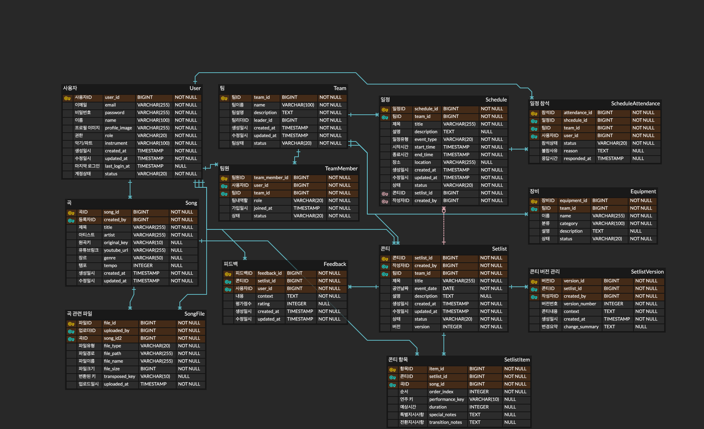

# NewDpraise - 공연 콘티 관리 시스템
## 프로젝트 소개
NewDpraise는 월간 공연 및 밴드 활동을 위한 콘티 관리 및 음원 처리 서비스입니다. 이 프로젝트는 예배팀, 밴드, 공연팀이 공연 준비를 효율적으로 할 수 있도록 도와주는 올인원 솔루션을 제공합니다.

## 주요 기능
NewDpraise는 다음과 같은 핵심 기능을 제공합니다:

### 1. 회원 및 팀 관리
- 사용자 등록 및 인증
- 역할 기반 권한 관리 (관리자, 팀 리더, 팀원)
- 팀 생성 및 관리
- 팀원 초대 및 관리

### 2. 콘티 관리 시스템
- 텍스트 형태 콘티 파싱 및 구조화
- 콘티 작성 및 편집
- 버전 관리 및 히스토리 추적
- 태그 기반 검색 및 필터링

### 3. 음원 처리
- 유튜브 링크 통합 및 메타데이터 추출
- 음원 다운로드 및 관리
- 키 조정 및 음질 보존
- 음원 라이브러리 관리

### 4. 악보 관리
- 다양한 형식의 악보 업로드/다운로드
- 모바일/태블릿 최적화 뷰어
- 코드 및 주석 편집
- 팀원 간 악보 공유

### 5. 공연 준비 지원
- 공연/연습 일정 관리
- 참석 확인 및 관리
- 리허설 모드 지원
- 장비 체크리스트 및 관리

## ERD

### 주요 엔티티 설명
- **User**: 시스템 사용자 정보
- **Team**: 밴드/예배팀 정보
- **TeamMember**: 팀 구성원 관계
- **Song**: 곡 정보 및 메타데이터
- **SongFile**: 곡 관련 파일 (음원, 악보 등)
- **Setlist**: 공연 콘티 정보
- **SetlistItem**: 콘티 내 개별 곡 정보
- **Schedule**: 일정 관리
- **ScheduleAttendance**: 일정 참석 정보
- **Equipment**: 장비 관리
- **SetlistVersion**: 콘티 버전 관리
- **Feedback**: 공연 후 피드백 관리

## 기술 스택
### 백엔드
- Java 17
- Spring Boot 3.4.4
- Spring Security (인증 및 권한)
- Spring Data JPA (데이터 접근)
- MySQL (데이터베이스)
- Lombok (코드 간소화)

### 음원 처리
- youtube-dl-java (음원 다운로드)
- TarsosDSP (피치 조정)
- FFmpeg (포맷 변환)

### 기타 도구 및 라이브러리
- Gradle (빌드 도구) 
- Spring Dotenv (환경 변수 관리)
- Docker (컨테이너화)

## 프로젝트 로드맵
- [ ] 초기 프로젝트 설정 및 데이터베이스 모델링
- [ ] 사용자 인증 및 팀 관리 기능 구현
- [ ] 콘티 관리 핵심 기능 구현
- [ ] 음원 처리 기능 통합
- [ ] 악보 관리 시스템 개발